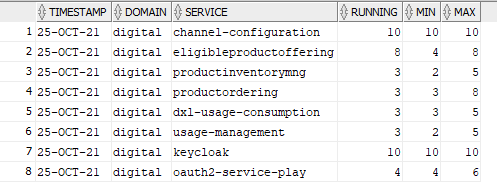

[![LinkedIn][linkedin-shield]][linkedin-url]

<!-- PROJECT LOGO -->
 

  
  <h3 align="center">Automated Capacity Tracking for OpenShift Services</h3>

<!-- TABLE OF CONTENTS -->

  
Table of Contents

  <ol>
    <li>
      <a href="#about-the-project">About The Project</a>
      <ul>
        <li><a href="#business-case">Business Case</a></li>
        <li><a href="#technical-solution">Technical Solution</a></li>
        <li><a href="#tech-stack">Tech Stack</a></li>
      </ul>
    </li>
    <li><a href="#contact">Contact</a></li>
  </ol>

<!-- ABOUT THE PROJECT -->
## About The Project

* Project Name: Automated Capacity Tracking for OpenShift Services
* Version: v1.0.0
* Organization Department: Technology

### Business Case
Managing the capacity utilization of services running on an OpenShift cluster is essential for ensuring optimal resource allocation. The challenge was that the OpenShift GUI only provided real-time snapshots of pod utilization and configurations (minimum and maximum pod limits) without offering historical data or trends. This made it difficult to analyze capacity needs, service scalability, and whether configured limits were sufficient over time. To address this, an ETL pipeline was needed to gather and store historical data for better capacity planning and system expansion.

(<a href="#readme-top">back to top</a>)

### Technical Solution
This ETL pipeline automates the extraction, transformation, and loading of pod utilization data from OpenShift to an Oracle database. By running every 15 minutes, it builds a continuous trend of capacity utilization for each service, enabling deeper insights and more efficient management of system resources.

**Key Features:**

* **Data Extraction:**
    * Connects to the OpenShift cluster via the Python client.
    * Retrieves the current number of running pods, as well as the configured minimum and maximum pod counts for each service.
    * Extracts this information for three different namespaces.
* **Data Transformation:**
    * Adds a static value to represent the domain of the services.
    * Captures the current timestamp for historical tracking.
* **Data Loading:**
    * Checks if the "openshift" table exists in the Oracle database, creating it if necessary.
    * Ingests the extracted values along with the timestamp into the Oracle database every 15 minutes, allowing trend analysis.

**Benefits:**

* **Capacity Planning:** Provides historical trends to answer critical questions, such as the maximum number of pods needed, the utilization percentage, and whether the configured minimum pods are sufficient for each service.
* **Automation:** Eliminates manual data collection, ensuring up-to-date and continuous tracking of pod utilization.
* **Improved Resource Management:** Helps in optimizing capacity utilization, allowing for better scalability and resource expansion decisions.

(<a href="#readme-top">back to top</a>)

### Tech Stack

This project was developed using the following tech stack:

* Python (Libraries: pandas, cx_Oracle, Kubernetes, requests, datetime)
* OpenShift API (for data retrieval)

(<a href="#readme-top">back to top</a>)

<!-- CONTACT -->
## Contact

Mohamed AbdelGawad Ibrahim - [@m-abdelgawad](https://www.linkedin.com/in/m-abdelgawad/) - <a href="tel:+201069052620">+201069052620</a>

(<a href="#readme-top">back to top</a>)

<!-- MARKDOWN LINKS & IMAGES -->
<!-- https://www.markdownguide.org/basic-syntax/#reference-style-links -->
[linkedin-shield]: https://img.shields.io/badge/-LinkedIn-black.svg?style=for-the-badge&logo=linkedin&colorB=555
[linkedin-url]: https://www.linkedin.com/in/m-abdelgawad/
